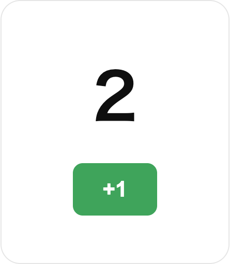

<!-- {"key":"cover","layout":"cover","section":"導入","time":"60s","page_number":false} -->
# *BarefootJS*の事例からみるテスト技法*六選*

**ToKyoto.js #03** / kobaken

<!--
TODO
-->

---

<!-- {"key":"whoami","layout":"profile","section":"自己紹介","time":"20s"} -->
# kobaken a.k.a @kfly8

::: {slot=photo-real}


:::

::: {slot=photo-icon}


:::

- 初めて書いたプログラミング言語は、**JavaScript**
- YAPC::Tokyo 2019, YAPC::Japan::Online 2022, YAPC::Hiroshima 2024 のリード
- 個人事業主、個人開発

<!--
TODO
-->

---

<!-- {"key":"why-testing","layout":"centerpiece","section":"Why Testing","time":"10s"} -->
# この発表で実現できたら嬉しいこと

不具合発見に役立つこと

<!--
コーディングエージェントに
-->

---

<!-- {"key":"overview","layout":"title-body-code","section":"BarefootJS","time":"240s"} -->
# BarefootJS とは

- signal ベースの **TSX** を 複数のバックエンド言語の**ネイティブなテンプレート**にコンパイル
- Node.jsが不要
    - Next.js といったBFFのレイヤーは不要
- SolidJS 由来の細粒度リアクティビティ 
- 超釈: jQueryで手動配線 → TSXをコンパイルして自動配線

<!--
TODO
-->

---

<!-- {"key":"counter-live","layout":"shot"} -->
::: {slot=image}



:::

<!--
実際に compileJSX でコンパイルし、本物のクライアントランタイムでハイドレートしたスクリーンショット。
+1 を 3 回押した状態。作り話ではなく、本当に動く。
-->

---

<!-- {"key":"jquery-counter","layout":"code"} -->
# jQuery

「何が変わったから、どこを更新するか」を手動管理

```html {2-3|6|7-10}
<div id="counter">
  <p id="value">0</p>
  <button id="inc">+1</button>
</div>
<script>
let count = 0
$('#inc').on('click', () => {
  count++
  $('#value').text(count)
})
</script>
```

<!--
何の変哲もないjQueryのコードです。
DOMにidのマーカーをつけて、(めくり)
countという値を用意したら、(めくり)
clickイベントでincrementし、#value のDOMを更新しています
-->

---

<!-- {"key":"counter-src","layout":"code"} -->
# Signal based TSX

```tsx {6|10-11}
'use client'

import { createSignal } from '@barefootjs/client'

export function Counter(props: { initial?: number }) {
  const [count, setCount] = createSignal(props.initial ?? 0)

  return (
    <div>
      <p>{count()}</p>
      <button onClick={() => setCount(n => n + 1)}>+1</button>
    </div>
  )
}
```

<!--
これも見慣れたTSXだと思います。
count signalを用意し、(めくり)
イベント登録と表示をしています
-->

---

<!-- {"key":"counter-expected","layout":"dual-code"} -->
# BarefootJSがTSXをコンパイルして得るもの

::: {slot=code-left}

```html
# マーカーつきのHTML
<div bf-s="Counter_0" bf-r=""
     bf-p='{"initial":0}'>
  <p bf="s1"><!--bf:s0-->0<!--/--></p>
  <button bf="s2">+1</button>
</div>
```
:::

::: {slot=code-right}

```js
export function initCounter(__scope, _p = {}) {
  const [count, setCount] =
    createSignal(_p.initial ?? 0)

  const [_s2] = $(__scope, 's2')
  const __bfw_s0 = lazySlots(__scope, [
    { id: 's0', kind: 'markup', path: [] }
  ])
  createEffect(() => {
    const __val = count()
    __bfw_s0('s0', escapeTextOrNode(__val))
  })
  if (_s2) {
    _s2.addEventListener('click', () => {
      setCount(n => n + 1)
    })
  }
}
```

:::

<!--
TODO
-->

---

<!-- {"key":"auto-wiring","layout":"snippet"} -->
# 手動配線 → 自動配線

```
# マーカーつきのHTML
<button bf="s2">+1</button>

# マーカーを利用し、DOM取得、イベント登録
const [_s2] = $(__scope, 's2')
_s2.addEventListener('click', () => setCount(n => n + 1))
```

- TSXに書いたのは `onClick={...}` だけ
- `bf` 属性も `$()` の selector も、両方コンパイラが生成
- けれど、中身の本質はjQuery時代と同じDOM操作。レガシー
- つまり、*BarefootJSはTSXでMPAできるフレームワーク*とも言える

<!--
TODO
-->

---

<!-- {"key":"counter-hono","layout":"code"} -->
# Hono

→ hono/jsx

```tsx
export function Counter(__allProps: CounterProps & { __instanceId?: string /* ... */ }) {
  const { __instanceId, /* ... */ ...props } = __allProps
  const count = () => props.initial ?? 0

  return (
    <div bf-s={__scopeId} /* bf-r, bf-p ... */>
      <p bf="s1">{bfText("s0")}{count()}{bfTextEnd()}</p>
      <button onClick={() => {}} bf="s2">+1</button>
    </div>
  )
}
```

<!--
-->

---

<!-- {"key":"counter-go","layout":"code"} -->
# Go

→ html/template

```html
{{define "Counter"}}
{{if .Scripts}}{{.Scripts.Register "/static/client/barefoot.js"}}
             {{.Scripts.Register "/static/client/Counter.client.js"}}{{end}}
<div bf-s="{{bfScopeAttr .}}"
     {{bfHydrationAttrs .}} {{bfPropsAttr .}}
     {{if .BfDataKey}} data-key="{{.BfDataKey}}"{{end}}>
  <p bf="s1">
    {{bfTextStart "s0"}}{{.Count}}{{bfTextEnd}}
  </p>
  <button bf="s2">+1</button>
</div>
{{end}}
```

<!--
-->

---

<!-- {"key":"counter-rust","layout":"code"} -->
# Rust

→ minijinja

```html



<div bf-s="{{ bf.scope_attr() }}"
     {{ bf.hydration_attrs() | safe }} {{ bf.props_attr() | safe }}>
  <p bf="s1">
    {{ bf.text_start("s0") | safe }}{{ bf.string(count) }}{{ bf.text_end() | safe }}
  </p>
  <button bf="s2">+1</button>
</div>
```

<!--
-->

---

<!-- {"key":"counter-ruby","layout":"code"} -->
# Ruby

→ ERB

```erb
<%- bf.register_script('/static/components/barefoot.js') -%>
<%- bf.register_script('/static/components/Counter.client.js') -%>
<% v[:count] = ((v[:initial]).nil? ? 0 : v[:initial]) %>
<div bf-s="<%= bf.scope_attr %>"
     <%= bf.hydration_attrs %> <%= bf.props_attr %>>
  <p bf="s1">
    <%= bf.text_start("s0") %><%= bf.h(v[:count]) %><%= bf.text_end %>
  </p>
  <button bf="s2">+1</button>
</div>
```

<!--
-->

---

<!-- {"key":"counter-python","layout":"code"} -->
# Python

→ Jinja2

```html



<div bf-s="{{ bf.scope_attr() }}"
     {{ bf.hydration_attrs() | safe }} {{ bf.props_attr() | safe }}>
  <p bf="s1">
    {{ bf.text_start("s0") | safe }}{{ bf.string(count) }}{{ bf.text_end() | safe }}
  </p>
  <button bf="s2">+1</button>
</div>
```

<!--
-->

---

<!-- {"key":"counter-php","layout":"code"} -->
# PHP

→ Laravel Blade

```php
@php($bf->register_script('/static/components/barefoot.js'))
@php($bf->register_script('/static/components/Counter.client.js'))
@php($count = ($initial ?? 0))
<div bf-s="{!! e($bf->scope_attr()) !!}"
     {!! $bf->hydration_attrs() !!} {!! $bf->props_attr() !!}>
  <p bf="s1">
    {!! $bf->text_start("s0") !!}{!! e($bf->string($count)) !!}{!! $bf->text_end() !!}
  </p>
  <button bf="s2">+1</button>
</div>
```

<!--
-->

---

<!-- {"key":"counter-perl","layout":"code"} -->
# Perl

→ Mojolicious EP

```perl
% bf->register_script('/static/components/barefoot.js');
% bf->register_script('/static/components/Counter.client.js');
% my $count = ($initial // 0);
<div bf-s="<%= bf->scope_attr %>"
     <%== bf->hydration_attrs %> <%== bf->props_attr %>>
  <p bf="s1">
    <%== bf->text_start("s0") %><%= $count %><%== bf->text_end %>
  </p>
  <button bf="s2">+1</button>
</div>
```

<!--
-->

---

<!-- {"key":"voice","layout":"shot"} -->
# 街の声

```embed
https://x.com/AnaTofuZ/status/2091460034849013825
```

---

<!-- {"key":"really","layout":"centerpiece","section":"本当に動くのか","time":"60s"} -->
# 本題

本当に*動く*のか？

<!--
ここから本題。
-->

---

<!-- {"key":"goal","layout":"title-body-code","section":"ヒューリスティックから探索へ","time":"360s"} -->
# 本当に*動く*のか？

- 「Counter が動く」のと「TSXが全部動く」のは大きく違う
- 「全部」となると、TypeScriptを全て翻訳するのと等価
- スコープを決め、Sound or Loud という方針設定
    - Sound  期待通りに動く
    - Loud - 黙って壊れず明示的にエラー
        - このとき、Clientに処理移譲 `/* @client */` directive 利用の提案
- コンパイルが通り動かないケースを探索する

<!--

-->

---

<!-- {"key":"heuristic","layout":"title-body-code"} -->

# 探索のはじまり

- ヒューリスティック
    - Counter
    - shadcn/ui の移植
    - ドッグフーディング
    - AI Agentにオンボーディングさせる
- → 仕様・設計を固めていく
    - 適合性テストの設計

<!--

-->

---

<!-- {"key":"conformance-test","layout":"title-body-code"} -->

# 1. 適合性テスト(Conformance testing)

- 仕様に適合してるか
- [Test262](https://github.com/tc39/test262)
    - ECMAScriptの仕様書をテストスイートにしたもの
    - `{ const f=0; const f=0; }` はエラーになるべきなど
- [Roast](https://github.com/raku/roast)
    - テストスイートそのものがRakuの仕様そのもの
    - BarefootJSの場合、この方式を採用

<!--
充実すると、回帰の恐れが減る
-->

---
<!-- {"key":"conformance-test-barefootjs","layout":"code"} -->

# BarefootJSの適合性テスト

固定したexpectedHtmlを全アダプタ共通の仕様に

```typescript
// TSXを入力、Honoアダプタ生成のHTMLを期待値に
export const fixture = createFixture({
  id: 'counter',
  source: `
'use client'
import { createSignal } from '@barefootjs/client'
export function Counter() {
  const [count, setCount] = createSignal(0)
  return <button onClick={() => setCount(n => n + 1)}>Count: {count()}</button>
}
`,
  expectedHtml: `
    <button bf-s="test" bf="s1">Count: <!--bf:s0-->0<!--/--></button>
  `,
})
```

<!--
-->

---

<!-- {"key":"motto","layout":"title-body-code"} -->

# ヒューリスティックから構造的な探索へ 

- 徐々に不具合を発見しづらくなる
    - Claude Code `/code-review` といったスキルでは物足りない
- 対象の構造、性質を踏まえて、壊す
    - e.g. [Gleamコンパイラのファジング](https://www.kurz.net/posts/fuzzing-gleam-compiler)

---

<!-- {"key":"adversarial-concept","layout":"title-body-code"} -->
# 2. 敵対的テスト(Adversarial testing)

- 意図的に意地悪な値をいれる手法
    - (`/code-review` もそのエッセンスは入ってる)
- 機械的な検証: 境界値カタログ
    - データ型ごとに「壊れやすい値」のカタログを用意
        - string → `'', '<b>&"\'</b>', '😊'` // 空、マーク、マルチバイト
        - number → `0, -7, Number.MAX_SAFE_INTEGER` // ゼロ・負数・巨大値
        - array → 空配列
    - このカタログの値に自動差し替えするプログラムを書く

<!--
-->

---

<!-- {"key":"adversarial-apply","layout":"snippet"} -->
# BarefootJSの敵対的境界値テスト

```
Counter { initial?: number }
→  initial = 0 / -7 / Number.MAX_SAFE_INTEGER
```

- 適合テストのfixtureのPropsのデータ型をみる
- 「壊れやすい値」の差し替え検証
- 発見例: Go の href が percent-encode で リファレンスの JS と食い違う

<!--

-->

---

<!-- {"key":"mutation-concept","layout":"title-body-code"} -->
# 3. メタモルフィックテスト(Metamorphic testing)

- 期待値が設定困難なときのテスト手法の一つ
- **入力を変化させたとき**、出力の変化の関係性をテストする
- 例: 入力を変化させても、出力は「変わらないはず」と書く


```ts
sort(shuffle(array)) == sort(array)   // 並べ替えても、結果は同じはず
f(alias(x)) == f(x)             // 名前を付け替えても、結果は同じはず
```

<!--

-->

---

<!-- {"key":"mutation-apply","layout":"snippet"} -->
# BarefootJS のメタモルフィックテスト

```tsx
return <div>{x}</div>                        // original
return <><div>{x}</div></>                   // fragment-wrap
{ const foo = <div>{x}</div>; return foo }   // block-body
```

- 入力のTSXを、フラグメント付与、変数代入経由して変化させる
- けれども出力のHTMLは変わらない、のように検証

<!--
-->

---

<!-- {"key":"oracle-concept","layout":"title-body-code"} -->
# 4. 疑似オラクル(Pseudo-oracle)

- 期待値が設定困難なときのテスト手法の一つ。メタモルフィックテストの仲間
- 入力は変えず、**複数の独立した経路の出力**をテストする
- 例: 経路が違っても、出力は「同じになるはず」と書く

```ts
pathA(x) == pathB(x)          // 独立した経路同士が、食い違わない
f(op(x)) == f(stateAfter)     // 操作した結果 = 状態を最初から作った結果
```

<!--

-->

---

<!-- {"key":"oracle-apply","layout":"snippet"} -->
# BarefootJS の疑似オラクル

```ts
// three-point agreement
dom(SSR) == dom(SSR + hydrate) == dom(CSR)

// 更新経路 == 初期描画経路
dom(click(el)) == dom(render(nextState))
```

- DOMを生成する経路が、CSR、SSR と複数経路ある
- が、入力が同じであれば、同じDOMになるはず

<!--

-->

---

<!-- {"key":"diff-concept","layout":"title-body-code"} -->
# 5. 差分テスト(Differential testing)

- 同じ入力を 2 つの実装に通し、出力の食い違いを見る手法
- 信頼できる実装（リファレンス）が、そのまま期待値になる
- コンパイラや、複数の実装を持つソフトウェアに効く
- 適合性テストと違い、期待値は保存せず、その場で比較
- 疑似オラクルと違い、リファレンス側を「正」に固定する

```ts
const ref = reference(input)    // 信頼できる実装
const out = target(input)       // 検証対象
expect(normalize(out)).toBe(normalize(ref))
```

<!--

-->

---

<!-- {"key":"diff-apply","layout":"snippet"} -->
# BarefootJS の差分テスト

```tsx
function Card(props) {
  const { children: kids } = props   // kidsに付け替え
  return <div>{kids}</div>
}
```

- 発見例: リファレンスのHonoアダプタと、Goアダプタで差があった
  - Goが識別子名childrenを決め打ちしていた。

<!--

-->

---

<!-- {"key":"pairwise-concept","layout":"title-body-code"} -->
# 6. ペアワイズ(Pairwise testing)

- 全組み合わせが困難なとき、**パターンを削減する手法**
- 「任意の2因子の値の全組合せが最低1回出現」する組み合わせでテスト
- バグの大半は、2〜3 要因の組み合わせで起きる
- **あとからテスト強度を上げやすい**

<!--

-->

---

<!-- {"key":"pairwise-apply","layout":"snippet"} -->
# BarefootJS のペアワイズ

```
TSXを次の5因子に分解
- state: 値がどこから来て、書き換え可能かどうか。例 signal value, memo
- structure: 条件分岐(三項演算子)、ループ、ネストした子コンポーネントなど
- binding: signalの値がDOMのどこにどう結びつくか
- event: 何がハンドラを起動するか。click, input など
- callback: ハンドラの中身の形。単純なインラインのアロー関数
```

- 2因子でまずは検証
- 次にバグを踏んだ実績から、次の3因子の組を強化
    - ループ構造、イベント、コールバック

<!--

-->

---

<!-- {"key":"takeaways","layout":"title-body-code","section":"まとめ","time":"90s"} -->
# まとめ

| 問い           | 技法              | 概要 |
|----------------|-------------------|------|
| 入力を作る     | 境界値カタログ    | 型ごとの壊れやすい値を代入 |
|                | ペアワイズ        | 全組合せの代わりに2因子を網羅 |
| 壊れを判定する | 適合性テスト      | 仕様通りに振る舞うか検証 |
|                | メタモルフィック  | 入力を変え、出力の関係を検証 |
|                | 疑似オラクル      | 独立した複数経路の出力を照合 |
|                | 差分テスト        | 2つの実装の出力を比較 |

<!--

-->

---

<!-- {"key":"punchline","layout":"cover","page_number":false} -->
# Happy *testing*
## & Happy hacking with *BarefootJS*

<!--
それでは楽しいテスト生活をお過ごしください。
-->

